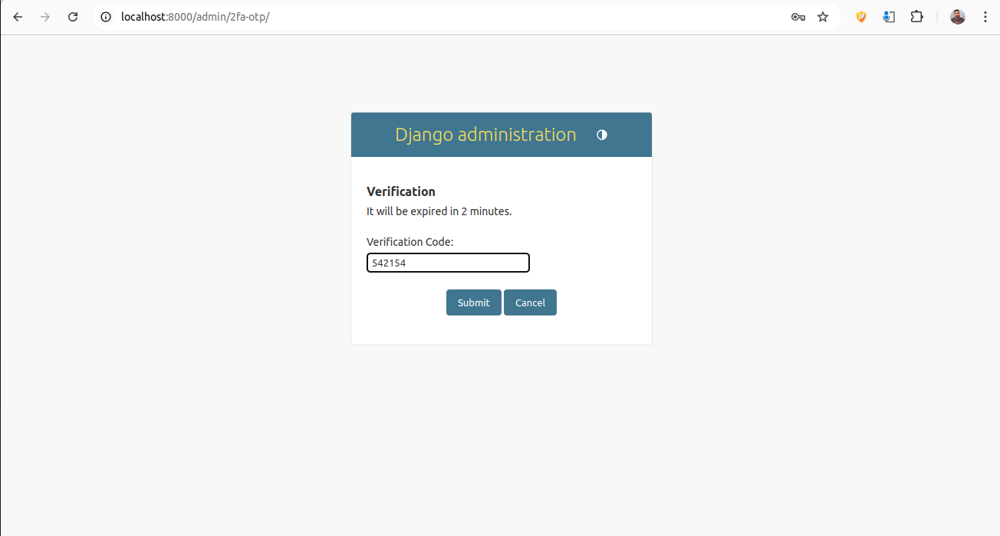
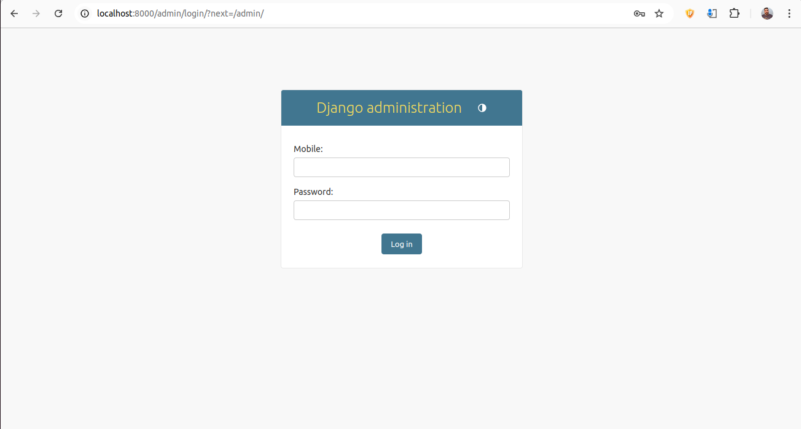
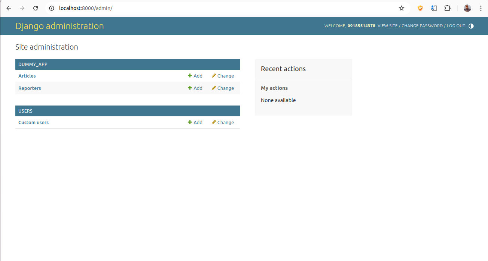
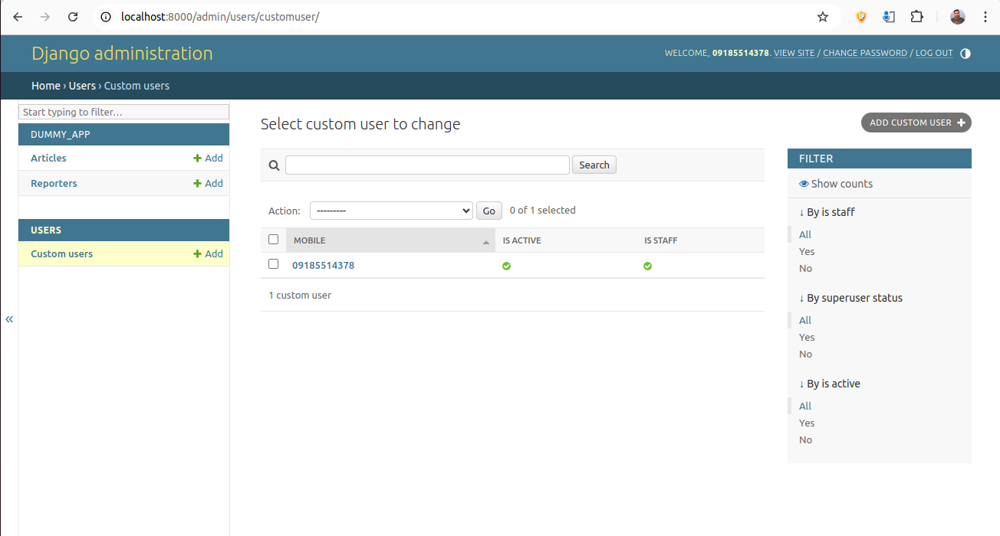
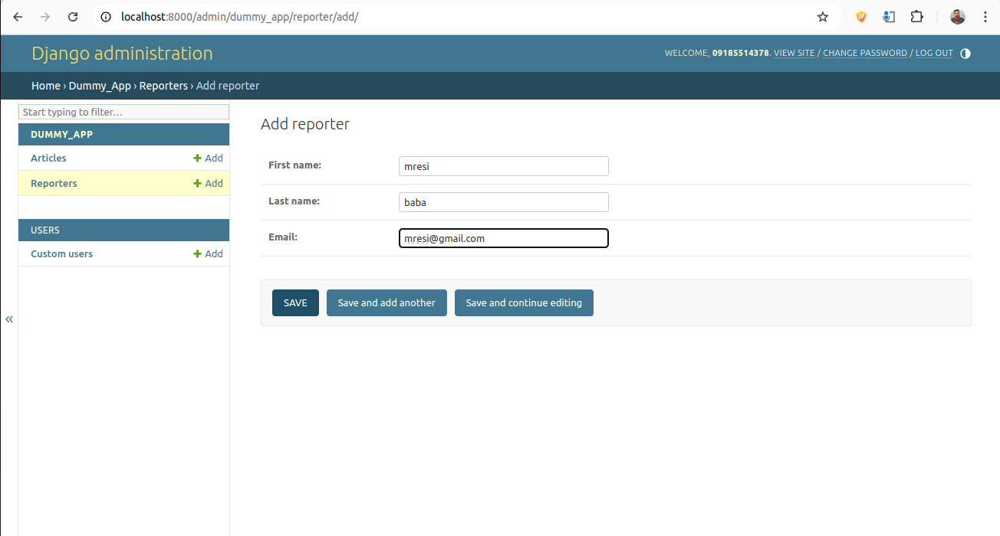
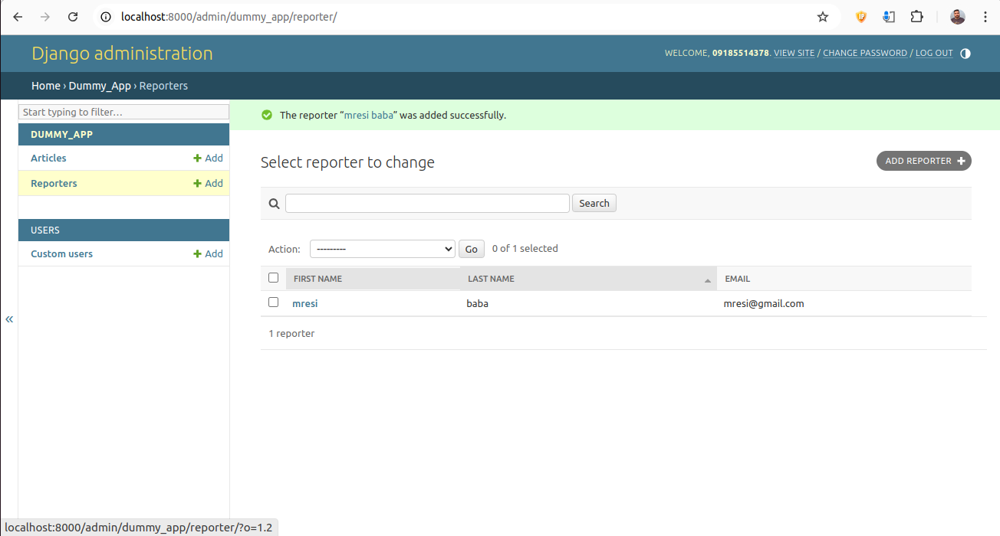
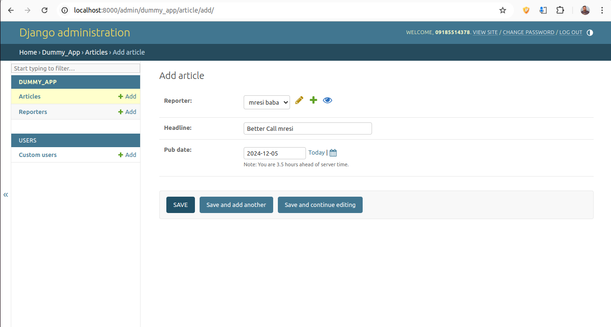
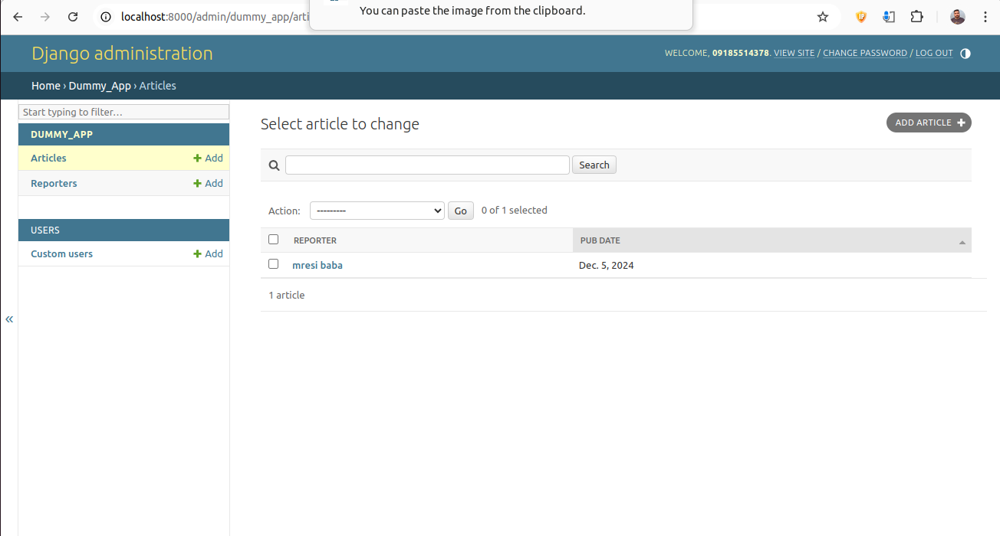

# Django Admin With two step verification via OTP-SMS

```Python
if viewer.liked.this:
    give_a_star(":))")
```

## Getting started

The Django Admin is a powerful tool but uses a basic username-and-password login, which can be a security concern. Many developers disable it for this reason. In this guide, we'll enhance its security by adding two-step verification (2FA) using SMS. After entering their credentials (mobile number and password), admins will need to verify their identity by entering a code sent to their phone before gaining access to the admin panel.





## How to use

1- Clone the github repository
2- set .env OTP_SERVICE_URL
3- if you need to change get_otp_code function to match your ot method, change it.
4- run
```
python manage.py migrate
```
5- run 
```
python manage.py startserver 0.0.0.0:8000
```

6- enjoy!


## Complete Guide

If you want to integrate it into your own project, follow this guide to understand the code.

First, we created a `dummy_app` to represent a basic Django application. This app includes two sample models (taken from the Django tutorials) that we'll use to demonstrate our custom admin registration. The `dummy_app` doesn't perform any specific functions—it's just for demonstration purposes.

Next, we created a `users` application. This app contains a `CustomUser` model (inside `models.py`) that includes a `mobile` field. This field is essential for our two-step verification process, as it will be used to send SMS verification codes.

### AdmineSite

The Django Admin includes a class called `AdminSite`, which can be inherited and customized to fit specific needs. In our case, we need to override two key methods:

1. **`get_urls`:** This allows us to add custom URLs for the OTP verification and cancellation views.
2. **`login`:** We override this method to introduce our new login process, integrating the two-step verification with SMS.

By customizing these methods, we can enhance the default login flow with additional security features.

First, create a `custom_admin` application. Using a Django app instead of a simple Python module is more scalable, allowing you to easily add new features in the future. 

After creating the app, add a `sites.py` file to it. This file will manage our custom admin functionalities. The default Django Admin also uses a `sites.py` file, which contains the `AdminSite` class and governs core admin functionalities. Naming our file `sites.py` helps maintain consistency and keeps everything organized and easy to integrate.

This is part of the code. It is important to note that the order of custom_patterns + urls is very important.

```Python

from django.contrib import admin

class AdminSite(admin.AdminSite):
    def get_urls(self):
        urls = super().get_urls()

        custom_patterns = [
            path("2fa-otp/", self.verify_otp, name="2fa-otp"),
            path("cancel-otp/", self.cancel_otp, name="cancel-otp"),
        ]

        # ! NOTE: order here is super important
        # ! because Django router checks each URL against the request url
        # ! and finds the first match.
        return custom_patterns + urls
    ...
```

The `login` method is a crucial part of the `AdminSite` class. It handles the login process by calling the superclass method for any request other than POST. For a POST request, the login form (from the template) sends user credentials for authentication. However, instead of directly logging in the user, we send an authentication code via SMS for two-step verification.

### Detailed Breakdown:

1. **Middleware Configuration:**  
   Ensure that the `messages` middleware is included in your `MIDDLEWARE` settings. This middleware allows us to display error messages to users, such as invalid login attempts or missing information.

2. **Request Handling:**  
   - **Non-POST Requests:** These requests, primarily GET, are handled by the superclass’s `login` method, which displays the login form.
   - **POST Requests:** This occurs when the user submits their credentials.

3. **Credential Validation:**  
   In the POST request:
   - **Check for Required Fields:** The method checks if both the `username` (in this project, it’s the `mobile` field) and `password` are provided. If either is missing, an error message is displayed using the `messages` framework.
   - **Custom User Field:** The `username` field is set to `mobile` in the `CustomUser` model. If you plan to use a different field, ensure your model includes it, and modify the code to reflect this change.

4. **Authentication Step:**  
   We use Django's `authenticate` method from `django.contrib.auth`:
   - This method checks the provided credentials against the database but does not log the user in.
   - If the credentials are valid, it returns the corresponding user object. If not, it returns `None`.
   - An error message is displayed if the authentication fails.

5. **Generating and Storing OTP:**  
   - If authentication is successful, we generate an OTP code using an external OTP service.
   - The OTP code, along with related information, is stored in the session:
     - **`login_state`:** Stores the primary key (`user.pk`) of the authenticated user. This will help retrieve the user in the next request.
     - **`otp_code`:** Contains the generated OTP for verification.
     - **`otp_exp`:** The expiration date and time for the OTP, stored in ISO format (for example, `2024-12-19T03:27:00Z`).

6. **Session Management:**  
   The session middleware handles storing and retrieving session data. When a session value is set, a `sessionid` cookie is created if it hasn’t already been set. In future requests:
   - The session middleware retrieves these values from the storage backend (e.g., a database).
   - These values are then made available in the `request.session` dictionary.

### Key Points:
- **Security Check:** OTP verification adds an additional security layer. Users must enter the correct OTP sent to their mobile phones before accessing the admin panel.
- **User Identification:** By storing `user.pk` in the session, the user can be securely identified during the OTP verification step.
- **Error Handling:** All error messages, such as invalid credentials or issues during OTP generation, are displayed using the `messages` framework.

This process ensures that after entering valid login credentials, the user is redirected to an OTP verification page. They must enter the correct OTP to gain access to the Django Admin panel, enhancing security beyond the default username-password mechanism.

```Python
... 
    def login(self, request, extra_context=None):
        """
        Use default login procedure for all methods other than POST (mainly GET).
        """
        if request.method == "POST":
            mobile = request.POST.get("username")
            password = request.POST.get("password")
            # print("Admin Login Creds:", mobile, password)

            if mobile is None or password is None:
                messages.add_message(request, messages.ERROR, "Username or Password is empty!")
            
            user = authenticate(request=request, mobile=mobile, password=password)
            if user is not None:
                # TODO: implement SMS OTP
                otp_code = get_otp_code(user.mobile)
                
                if otp_code is not None:
                    # TODO: handle session vars
                    # * We will create a session variable to store these:
                    # ! OTP code, OTP code exp date, login state
                    request.session["otp_attempts"] = 0
                    request.session["login_state"] = user.pk
                    request.session['otp_code'] = otp_code
                    request.session['otp_exp'] = (timezone.now() + timedelta(minutes=OTP_DURATION)).isoformat()
                    return redirect("/admin/2fa-otp/")
                
                else:
                    messages.add_message(request, messages.ERROR, "Something went wrong, please report this problem.")

                
            else:
                messages.add_message(request, messages.ERROR, "Wrong Username or Password!")
        
        return super().login(request, extra_context=extra_context)
...
```

<br/>
<br/>
<br/>


The next crucial step is implementing the `verify` view function within the `AdminSite` class. While we could define it in a separate `views.py` file, placing it inside the `AdminSite` class maintains structural integrity and coherence with the custom admin logic.

### Detailed Breakdown:

1. **Session Data Retrieval:**  
   The `verify` function accesses key information from the session, such as:
   - **`otp_code`:** The OTP code previously generated and stored.
   - **`login_state`:** The user’s primary key, stored during the initial login step.
   - **`otp_exp`:** The expiration timestamp of the OTP.

2. **Validation Checks:**  
   The function performs several critical checks to ensure the integrity and security of the OTP verification process:
   - **Max Attempts Check:**  
     To prevent brute-force attacks, the system limits the number of OTP entry attempts:
     ```python
     if request.session["otp_attempts"] >= MAX_OTP_ATTEMPTS:
         messages.add_message(request, messages.ERROR, "Too many attempts, try again later")
         request.session.flush()
         return redirect('admin:login')
     ```
   - **Expiration Check:**  
     Validates that the OTP has not expired:
     ```python
        if timezone.now() > otp_exp_date:
            messages.add_message(request, messages.ERROR, "Verification code expired, try Again")
            request.session.flush()
            return redirect('admin:login')
     ```

3. **OTP Verification:**  
   The entered OTP is compared to the stored OTP:
   ```python
    if input_otp==session_otp_code:
        # ! We saved user.pk in login state, 
        # ! we can retrieve the user record using this pk
        user_pk = request.session.get('login_state', None)
        
        if user_pk is not None:
            user = get_user_model().objects.get(pk=user_pk)
            
            # sets the request.user object for next requests
            auth_login(request, user) 
            
            request.session.pop('otp_attempts', None)
            request.session.pop('login_state', None)
            request.session.pop('otp_code', None)
            request.session.pop('otp_exp', None)
            
            return redirect('admin:index') # Enjoy the Django Dashboard
   ```

4. **Successful Authentication:**  
   If the OTP is correct:
   - **User Login:** Retrieves the user using the stored `user.pk` and logs them in:
     ```python
        if user_pk is not None:
            user = get_user_model().objects.get(pk=user_pk)
            
            # sets the request.user object for next requests
            auth_login(request, user) 
     ```
   - **Session Cleanup:** Clears sensitive session data:
     ```python
        request.session.pop('otp_attempts', None)
        request.session.pop('login_state', None)
        request.session.pop('otp_code', None)
        request.session.pop('otp_exp', None)
                    
     ```

5. **Session Management:**  
   If any validation fails:
   - **Session Flush:** Clears the entire session, including session cookies, to ensure a fresh start on the next login attempt:
     ```python
     request.session.flush() 
     ```

### Key Points:
- **Security Enhancements:**  
  By implementing maximum attempt limits and expiration checks, the system mitigates brute-force attacks and session hijacking.
- **User Experience:**  
  Clear error messages and session management ensure that users understand why their session might have ended and guide them to retry safely.
- **Session Integrity:**  
  Flushing the session upon failed checks ensures no leftover sensitive data remains, enhancing overall security.

This approach ensures a secure and smooth two-factor authentication process within your custom Django Admin setup.


<br/>
<br/>

The cancel OTP class is fairly simple. we redirect the user from OTP page to the login page. this happens inside the `templates/admin/2fa_verification.html` using this part of the code -> **`onclick="window.location.href=''"`**.

```HTML



  
    
      <p class="errornote">
	{{ error }}
      </p>
    
  


  <h2>Verification</h2>
  <p>It will be expired in 2 minutes.</p>
  <form action="" method="post">
    
    <div class="form-row">
        <label for="otp">Verification Code:</label>
        <input type="text" name="otp" required>
    </div>
    <div class="submit-row">
      <input type="submit" value="Submit">
      <input type="button" value="Cancel" onclick="window.location.href=''">
    </div>
  </form>

```

<br/>
<br/>

The final step is to create an instance of our AdminSite, Django admin also has created a global instance of admin site inside its sites.py which is used to register models, etc. This instance will be imported into any admin.py and the models will be registered using this object.

```Python
admin_site = AdminSite(name='custom_admin')
```

Before registering any model, we need to add our new custom_admin to the INSTALLED_APPS. First we need to create an `CustomAdminConfig` based on the django admin `AdminConfig` class. Django will use this config to access its components. This is what the INSTALLED_APPS will look like after the change:

```Python
INSTALLED_APPS = [
    # 'django.contrib.admin',
    'custom_admin.apps.CustomAdminConfig',
    'django.contrib.auth',
    'django.contrib.contenttypes',
    'django.contrib.sessions',
    'django.contrib.messages',
    'django.contrib.staticfiles',
    'dummy_app',
    'users',
]
```

Then change the urls.py (the one beside the settings.py) accordingly:

```Python
urlpatterns = [
    # path('admin/', admin.site.urls),
    path('admin/', admin_site.urls),
]
```


<br/>
<br/>


finally, register your models and enjoy. These registered models from the dummy_app. you can also add your third party models such as celery Periodic tasks, etc.


```Python
from django.contrib import admin
from custom_admin.sites import admin_site
from dummy_app.models import Article, Reporter


class ArticleAdmin(admin.ModelAdmin):
    list_display = ('reporter', 'pub_date',)
    fields = ('reporter', 'headline', 'pub_date',)
    search_fields = ('reporter',)
    ordering = ('pub_date',)
    
    
# admin.site.register(Article, ArticleAdmin)
admin_site.register(Article, ArticleAdmin) #! custom admin instance


class ReporterAdmin(admin.ModelAdmin):
    list_display = ('first_name', 'last_name', 'email',)
    fields = ('first_name', 'last_name', 'email',)
    search_fields = ('first_name', 'last_name', 'email',)
    ordering = ('last_name',)
    
    
# admin.site.register(Reporter, ReporterAdmin)
admin_site.register(Reporter, ReporterAdmin) #! custom admin instance


# ! Register any third-party model such as celery models, ...
# ? EXAMLE: admin_site.register(TaskResult)
# ? EXAMLE:  admin_site.register(PeriodicTasks)
# ? EXAMLE:  admin_site.register(PeriodicTask)
```


### Demo



<br/>
<br/>


<br/>
<br/>


<br/>
<br/>


<br/>
<br/>


<br/>
<br/>


<br/>
<br/>


<br/>
<br/>



